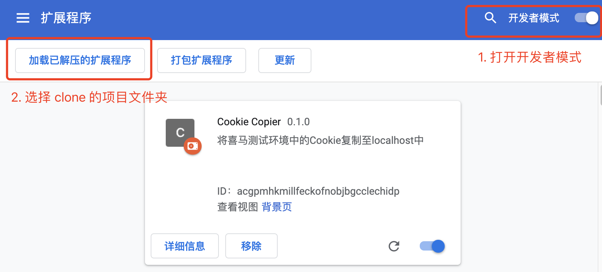
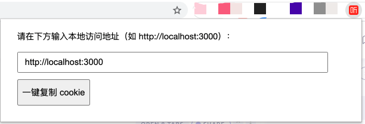

## 安装方法

- 1. clone 或下载项目至本地

- 2. 进入 Chrome 的扩展管理页面

地址栏输入：[chrome://extensions/](chrome://extensions/)

- 3. 打开开发者模式，加载已解压的扩展程序

## 使用方法

安装完成后，点击扩展的图标，会出现如下窗口。

填写本地的开发路径 `http://localhost:3000`、`http://127.0.0.1:3000` 等（因为 cookie 不区分端口，这里路径上的端口实际上可任意填写）。

然后点击按钮即可。

## 问题

Chrome 扩展在匿名模式下不能写入 cookie？
